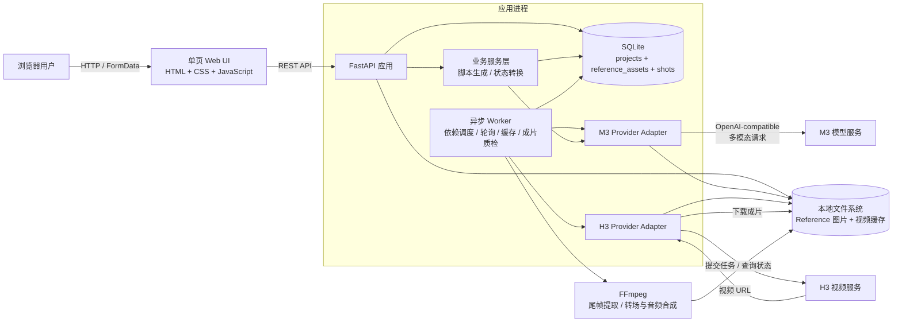
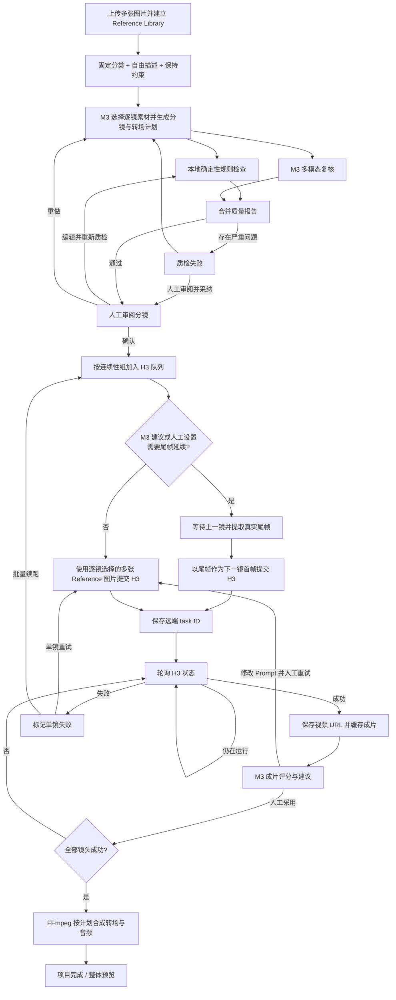
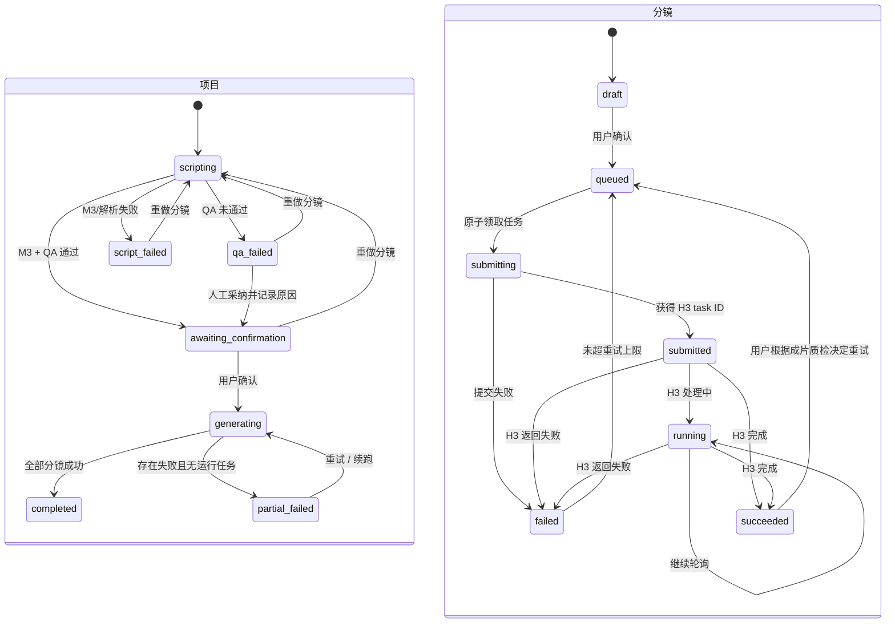

# 商品短视频流水线架构

导出的图片版本：[技术架构 PNG](./technical-architecture.png) · [业务架构 PNG](./business-architecture.png)

## 1. 技术架构

### 技术分层

| 层级 | 当前实现 | 职责 |
|---|---|---|
| 展示层 | `app/static/index.html` | Reference Library CRUD、逐镜素材选择、项目导航、整体预览、Prompt 编辑与人工重试 |
| API 层 | `app/main.py` | 素材与项目 CRUD、参数校验、本地媒体访问、状态转换入口 |
| 业务层 | `app/service.py` | 参考素材编排、连续性计划校验、依赖调度、尾帧提取、缓存、质检与合成 |
| 适配层 | `app/providers.py` | 隔离 M3/H3 的具体 HTTP 协议 |
| 质量层 | `app/quality.py` | 确定性规则检查与模型报告合并 |
| 持久层 | `app/db.py` + SQLite | 项目、Reference 资产、逐镜选择、分镜状态与远端任务 ID |
| 后台执行 | 进程内 asyncio worker | 提交 H3、轮询状态、失败恢复 |

## 2. 业务架构

## 3. 项目与分镜状态机

## 4. 当前部署边界

当前是单机 MVP：API、worker、SQLite、商品图和视频缓存位于同一主机。浏览器刷新或服务重启后仍可通过项目列表恢复工作，但数据不会跨机器同步。生产化时建议将 worker 替换为 Celery、RQ 或 Temporal，将 SQLite 换成 PostgreSQL、视频缓存换成对象存储，并为 H3 提交增加服务端幂等键；展示层与 Provider 接口可以继续沿用。
