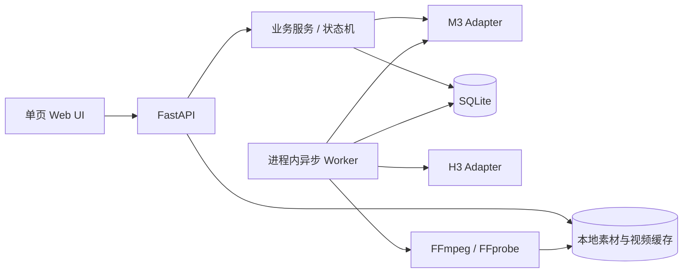

# MiniMax 商品短视频生成工作流

一个面向商品广告创作的 Human-in-the-loop 视频生成 MVP。系统使用 **MiniMax M3** 理解商品参考图、编排分镜并进行脚本/成片质检；用户确认分镜后，再由 **MiniMax H3** 逐镜生成视频。项目状态、素材、脚本、质检报告和成片都可以持久化，支持中断恢复、单镜修改与重试。

> 本项目为 MiniMax FD 面试作业。设计重点不是“一键生成”，而是让不可控的生成过程变成可检查、可修改、可恢复的生产工作流。

[技术架构图](./technical-architecture.png) · [业务流程图](./business-architecture.png) · [完整架构说明](./ARCHITECTURE.md)

## 下载并启动

需要 Python 3.9+，合成预览和尾帧提取还需要本机安装 `ffmpeg` 与 `ffprobe`。

```bash
git clone https://github.com/boshanchenus/product-video-pipeline.git
cd product-video-pipeline
python3 -m venv .venv
source .venv/bin/activate
pip install -r requirements.txt
cp .env.example .env
uvicorn app.main:app --reload --port 8000
```

启动后打开 <http://127.0.0.1:8000>。仓库内置 3 个真实测试项目；第一次启动且本地不存在 `data/` 时，它们会自动加载，其中包含 Reference、分镜、质检记录、逐镜视频和两条完整成片，可以直接浏览和导出。

默认使用 Mock 模式，不填写 API Key 也能体验完整交互。需要真实调用 M3/H3 时，在项目根目录的 `.env` 中填写：

```env
MINIMAX_API_KEY=sk-api-your-key
M3_MODE=openai
H3_MODE=http
```

也可以分别使用 `M3_API_KEY` 和 `H3_API_KEY`。`.env` 已被 Git 忽略，不会上传到仓库。若希望从空白数据库启动，将 `LOAD_SAMPLE_DATA=false`，并删除本地 `data/` 后重新启动。

## 核心流程


完整工作流：

`建立 Reference Library → M3 生成分镜 → 自动质检与定向修订 → 人工确认 → H3 多参考图/尾帧延续生成 → M3 成片质检 → FFmpeg 合成 → 预览与导出`

### 为什么保留人工确认

- M3 质检低于门槛时不会自动触发 H3，避免浪费视频生成额度。
- 用户可以一次修改多个镜头，再手动触发统一复核；旧质检意见会保留，便于逐项修正。
- 自动修订最多评估 3 个候选版本，达标即停止；都未达标时展示最高分版本，允许人工采纳，但仍需再次确认才会生成视频。
- 成片质检只给出评分、问题和重试 Prompt，不会无限自动重生成。

## 已实现能力

### 1. 多模态 Reference Library

- 新项目支持上传 1–9 张图片。
- 每张素材可设置主体类型、视角/用途标签、优先级、自由描述和必须保持的特征。
- 项目创建后仍可新增、查看、编辑和删除 Reference；生成中的项目会锁定素材修改。
- M3 在生成与单镜重写时会同时读取素材清单和真实图片，并为每镜推荐 1–4 张相关 Reference；用户可以覆盖选择。

### 2. 可控的 M3 分镜生成

- 输出结构化 Storyboard：标题、时长、H3 Prompt、旁白、屏显、转场、入场/收尾动作、连续性策略和素材引用。
- 确定性规则检查与 M3 多模态复核合并为统一质量门禁。
- 针对模型偶发的不规范 JSON，支持首个完整对象提取、语法修复重试和 Pydantic 校验。
- 单镜重写会提供最新完整 Storyboard、前后镜头、商品卖点、Reference Library 以及与该镜相关的质检问题；其他镜头及其配置保持不变。
- 包装品牌、Logo、容量以参考图为准，项目工作名不会被当成包装文字。

### 3. 镜头连续性与 H3 生成

- M3 为镜头边界推荐直接切、动作匹配、短叠化、淡出换场或尾帧延续。
- 用户可以逐镜开启或关闭“插入上一镜尾帧”。
- 独立镜头向 H3 提交所选多张 Reference；尾帧延续镜头等待上一镜完成，提取真实尾帧并作为下一镜首帧。
- 换人物、换场景或品牌定帧不强制使用尾帧，避免错误继承上一镜构图。
- 默认要求 H3 生成统一风格的原生画外音，并禁止各镜头独立生成背景音乐；也可以通过环境变量关闭。

### 4. 失败恢复与本地项目

- 项目、Reference、镜头状态、尝试次数、远端任务 ID、错误和质检结果写入 SQLite。
- 视频缓存至 `data/videos/{project_id}/`，合成成片位于 `data/previews/`。
- 服务启动后自动恢复 `queued/submitted/running` 镜头；`resume` 只继续未完成任务。
- 失败镜头或不满意的成功镜头可以单独修改 Prompt 后重试，不影响其他成片。
- 成片后仍可修改完整镜头结构；修改会使旧预览和导出立即失效，防止导出历史成片。
- 左侧项目列表可重新打开或永久删除历史项目。

## 关键技术设计

### 分层质量门禁

质量判断不是一次模型打分，而是由三个层次共同完成：

1. Pydantic 约束 Storyboard 的字段、枚举、长度和镜头时长。
2. 确定性规则检查卖点覆盖、绝对化宣称、屏显长度和结构完整性。
3. M3 结合 Reference 图片复核包装真实性、视觉可生成性、广告表达和镜头连续性。

系统以“分数达到阈值且不存在 `error`”作为唯一门禁。模型返回的 `info` 会归一化为 `warning`，模型复核暂时不可用时会保留规则检查结果并明确降级提示，避免非核心依赖让整个工作流失效。

### 非确定性模型输出的容错边界

M3 输出进入业务系统前必须经过完整对象提取、JSON 语法修复和 Schema 校验。自动修订并不覆盖上一版，而是保留本轮候选，以“是否通过、得分、硬错误数量、问题数量”排序选择最佳版本。这样既限制重试成本，也避免最后一次生成反而比前一版更差。

### 可恢复的分镜任务状态机

项目状态和镜头状态分开持久化。Worker 使用带前置状态的 SQL 更新原子领取 `queued` 镜头并递增尝试次数，防止同一进程内重复提交。H3 返回的 `task_id` 会在首次提交后立即保存；轮询遇到网络错误时保留任务 ID 并继续查询，而不是重新提交一个付费任务。

```text
draft → queued → submitting → submitted → running → succeeded
                    ↘ failed ←───────────────↗
```

服务重启后，Worker 会重新扫描 `queued/submitted/running` 状态。失败续跑只处理未完成镜头，成功镜头不会被重复生成；每镜还有独立的最大尝试次数。

### 基于依赖关系的连续性调度

镜头默认可以并行生成。只有 `carry_last_frame` 镜头形成对上一镜的依赖：Worker 等待上游成功，使用 FFmpeg 从本地成片提取尾帧，再以 H3 `first_frame` 方式提交下游镜头。若上游失败，下游会给出明确的依赖错误，不会使用错误素材继续生成。

这相当于一个轻量级镜头 DAG：在保证连续性的镜头段内顺序执行，在无依赖的广告切镜之间保持并行，从而兼顾生成质量和总耗时。

### 成片一致性与原子文件操作

- 远端视频会先写入 `.part` 临时文件，校验大小后再原子替换正式缓存，避免中断留下伪成片。
- 全部镜头成功后，FFmpeg 根据每个边界的转场类型与时长生成视频 `xfade`，音频使用同长度 `acrossfade`。
- 用户修改任意已完成镜头后，项目进入 `revision_pending`，旧预览和导出立即失效；只有所有变更镜头重新成功后才重建成片。
- 导出接口同时检查项目状态、数据库记录和文件存在性，避免新项目误用历史缓存。

## 技术架构



| 层级 | 文件 | 职责 |
|---|---|---|
| 展示层 | `app/static/index.html` | 项目导航、Reference CRUD、分镜编辑、质检、预览与导出 |
| API 层 | `app/main.py` | REST 接口、参数校验、本地媒体访问、状态转换入口 |
| 业务层 | `app/service.py` | 分镜候选生成、连续性计划、任务调度、恢复、缓存、质检与合成 |
| Provider 层 | `app/providers.py` | 隔离 M3/H3 HTTP 协议，提供 Mock 与真实实现 |
| 质量层 | `app/quality.py` | 确定性规则检查、模型报告归一化与合并 |
| 数据层 | `app/db.py` | SQLite 表结构、迁移和查询封装 |
| 数据模型 | `app/models.py` | Storyboard、QA、更新请求的 Pydantic Schema |

当前是单机 MVP，API、异步 Worker、SQLite 与文件缓存运行在同一台机器。多实例生产部署时，可将 Worker 替换为 Celery/RQ/Temporal、SQLite 替换为 PostgreSQL、本地文件替换为对象存储；业务状态机和 Provider 接口可以继续沿用。

## 接入 MiniMax

项目允许 M3/H3 使用同一个 MiniMax Key，也允许分别配置；实际可用模型取决于账号权限。

### M3

```env
MINIMAX_API_KEY=sk-api-your-key
M3_MODE=openai
M3_BASE_URL=https://api.minimax.io/v1
M3_MODEL=MiniMax-M3
M3_TIMEOUT_SECONDS=300
M3_JSON_REPAIR_ATTEMPTS=2
M3_ENABLE_REVIEW=true
M3_ENABLE_VIDEO_REVIEW=true
M3_STORYBOARD_MAX_ATTEMPTS=3
M3_STORYBOARD_PASS_SCORE=70
```

M3 Adapter 使用 OpenAI-compatible `chat/completions` 多模态格式。中国大陆开放平台可将地址改为 `https://api.minimaxi.com/v1`。

### H3

```env
H3_MODE=http
H3_BASE_URL=https://api.minimax.io
H3_MODEL=MiniMax-H3
H3_RESOLUTION=768P
H3_SUBMIT_PATH=/v2/video_generation
H3_STATUS_PATH=/v2/query/video_generation/{task_id}
H3_NATIVE_VOICEOVER=true
H3_DISABLE_BACKGROUND_MUSIC=true
```

H3 Adapter 使用异步协议：提交任务后持久化 `task_id`，Worker 轮询状态并缓存成功视频。中国大陆开放平台的 H3 地址可配置为 `https://api.minimax.cn`。

不要提交真实 `.env`；该文件已在 `.gitignore` 中排除。

## 主要 API

| 方法 | 路径 | 作用 |
|---|---|---|
| `POST` | `/api/projects` | 上传 Reference 与卖点，创建项目并生成分镜 |
| `GET` | `/api/projects` | 获取最近项目 |
| `GET/DELETE` | `/api/projects/{id}` | 查看或删除项目 |
| `POST/PATCH/DELETE` | `/api/projects/{id}/references...` | Reference Library 增删改 |
| `PATCH` | `/api/projects/{id}/shots/{shot_id}` | 编辑草稿或成片镜头结构 |
| `POST` | `/api/projects/{id}/shots/{shot_id}/rewrite-script` | M3 基于完整上下文重写单镜脚本 |
| `POST` | `/api/projects/{id}/recheck-script` | 手动重新评估全部分镜 |
| `PATCH` | `/api/projects/{id}/shots/{shot_id}/continuity` | 修改尾帧延续策略 |
| `PATCH` | `/api/projects/{id}/shots/{shot_id}/references` | 修改逐镜 Reference |
| `POST` | `/api/projects/{id}/override-qa` | 人工采纳未通过的脚本 |
| `POST` | `/api/projects/{id}/confirm` | 确认分镜并启动 H3 |
| `POST` | `/api/projects/{id}/resume` | 继续所有未完成镜头 |
| `POST` | `/api/projects/{id}/shots/{shot_id}/retry` | 修改 Prompt 并重试单镜 |
| `GET` | `/api/projects/{id}/preview` | 播放合成预览 |
| `GET` | `/api/projects/{id}/export` | 下载有效的完整 MP4 |

## 测试

```bash
pytest -q
```

测试覆盖完整 Mock 工作流、状态门禁、脚本修改与手动复核、M3 单镜重写上下文、Reference CRUD、H3 请求结构、失败镜头续跑、尾帧依赖、成片编辑失效旧导出，以及 JSON/QA 容错逻辑。

## 当前工程边界

- 当前 Worker 位于 API 进程内，适合演示和单机使用，不适合多实例水平扩展。
- H3 原生逐镜旁白的音色和逐字准确度由模型决定；若需要广播级一致性，应增加独立 TTS 与全片音轨混合层。
- 为避免六个镜头生成六段不连续的音乐，默认禁止 H3 生成背景音乐。统一 BGM 更适合在最终合成阶段一次加入。
